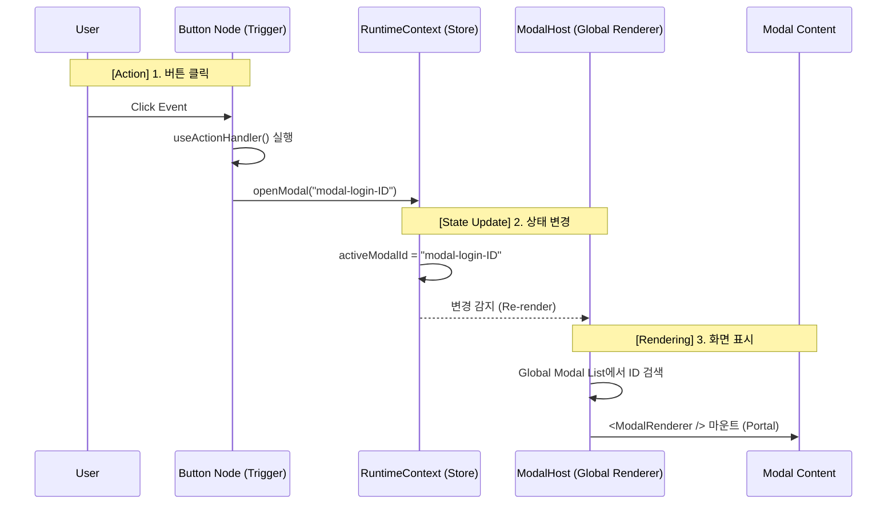

# 🏗️ WebCreator-X: Modal System Architecture

**Version:** 2.0.0 (Final)

**Last Updated:** 2025.12.18

**Author:** WebCreator-X Core Team

## 1. 개요 (Overview)

본 문서는 웹 빌더 내에서 가장 복잡한 인터랙션 요소인 **모달(Modal) 시스템**의 설계 및 구현 명세를 정의합니다.
기존의 개별 상태 관리 방식의 비효율성을 개선하기 위해 **중앙 집중식 호스트(Centralized Host)** 패턴을 채택하였으며, 에디터에서의 작업 효율을 위해 **격리 편집 모드(Isolation Mode)**를 도입했습니다.

### 🎯 핵심 목표

1. **성능 최적화:** 수십 개의 모달이 있어도 초기 로딩과 리렌더링 비용을 최소화한다.
2. **편집 편의성:** 에디터에서 모달이 작업 공간을 침범하지 않도록 별도 레이어에서 관리한다.
3. **연결성:** 버튼(Trigger)과 모달(Target)을 ID 참조(Reference) 방식으로 느슨하게 연결한다.

---

## 2. 아키텍처 (Architecture)

### 2.1 데이터 흐름도 (Data Flow)

모든 모달의 제어는 `RuntimeContext`를 통해 단방향으로 흐릅니다.



### 2.2 핵심 패턴: Modal Host

- **기존 방식 (Anti-Pattern):** 각 모달 컴포넌트가 개별적으로 `isOpen` 상태를 구독. (N개의 리스너)
- **최종 방식 (Best Practice):** 최상위 `ModalHost` 컴포넌트 **단 하나만** Context를 구독. 활성화된 모달 ID가 있을 때만 해당 콘텐츠를 동적으로 로드하여 렌더링.

---

## 3. 데이터 스키마 (Data Schema)

### 3.1 Runtime State (`RuntimeContext`)

복잡한 객체 대신 **단순 문자열 ID** 하나만 관리합니다.

```typescript
interface RuntimeContextType {
  // 현재 열려있는 모달의 ID (없으면 null)
  activeModalId: string | null;

  // 액션 함수
  openModal: (id: string) => void;
  closeModal: () => void;
}
```

### 3.2 Node Data Structure

DB의 `nodes` 테이블에 저장되는 데이터 구조입니다.

#### A. Modal Node (Target)

모달은 페이지(`page_id`)에 귀속되지 않고 전역(`Global`)으로 관리되는 것을 권장합니다.

```typescript
interface ModalNode {
  id: string;
  type: "Modal";
  props: {
    // ⭐️ 위치 프리셋: 마우스 드래그 대신 설정값으로 위치 결정
    alignment: "center" | "top" | "bottom" | "left" | "right";

    // 스타일 옵션
    width?: string;
    overlayColor?: string; // 예: "bg-black/50"
    closeOnOverlayClick?: boolean;

    // 애니메이션 효과
    animation?: "fade" | "slide-up" | "slide-right";
  };
  children: WcxNode[]; // 모달 내부의 텍스트, 인풋, 버튼 등
}
```

#### B. Button Node (Trigger)

버튼은 모달을 직접 포함하지 않고 **ID만 참조**합니다.

```typescript
interface ButtonNode {
  type: "Button";
  props: {
    text: "로그인";
    action: {
      type: "modal"; // 동작 타입
      targetId: "modal-1234"; // 🔗 연결된 모달의 ID 참조
    };
  };
}
```

---

## 4. 구현 상세 (Implementation Details)

### 4.1 `RuntimeContext.tsx`

상태 관리의 심장부입니다.

```tsx
export function RuntimeProvider({ children }: { children: ReactNode }) {
  // 초기값 null = 아무것도 안 열림
  const [activeModalId, setActiveModalId] = useState<string | null>(null);

  const openModal = (id: string) => setActiveModalId(id);
  const closeModal = () => setActiveModalId(null);

  return (
    <RuntimeContext.Provider value={{ activeModalId, openModal, closeModal }}>
      {children}
    </RuntimeContext.Provider>
  );
}
```

### 4.2 `ModalHost.tsx`

실제 렌더링을 담당하는 총괄 매니저입니다. `layout.tsx` 최상단에 배치됩니다.

```tsx
export function ModalHost() {
  const { activeModalId, closeModal } = useRuntimeState();
  const { modals } = useProjectData(); // 전역 모달 리스트 Fetch

  // 1. 활성화된 모달이 없으면 렌더링 자체를 안 함 (성능 최적화)
  if (!activeModalId) return null;

  // 2. ID에 맞는 모달 데이터 찾기
  const targetNode = modals.find((m) => m.id === activeModalId);
  if (!targetNode) return null;

  return (
    // 3. Portal을 사용하여 DOM 최상위로 이동 (z-index 문제 해결)
    <div
      className="fixed inset-0 z-[9999] flex items-center justify-center bg-black/50"
      onClick={closeModal}
    >
      <div onClick={(e) => e.stopPropagation()}>
        <ModalRenderer node={targetNode} />
      </div>
    </div>
  );
}
```

---

## 5. UI/UX 전략 (Editor vs Live)

### 5.1 격리 편집 모드 (Isolation Mode)

에디터에서 모달을 편집할 때의 UX 표준입니다.

1. **진입:** 사이드바 [모달 관리] 탭에서 모달 선택.
2. **화면 변화:**

- 기존 캔버스(페이지 노드들)는 `Dimmed` (어둡게) 처리되고 선택 불가능 상태가 됨.
- 선택된 모달만 화면에 렌더링됨.

3. **위치 설정:** 마우스 드래그 불가. 우측 속성 패널의 **[위치 프리셋]** 버튼(상/하/좌/우/중앙)으로 위치 조정.
4. **복귀:** 상단 [편집 종료] 버튼 클릭 시 모달이 사라지고 원래 페이지 편집 화면으로 복귀.

### 5.2 위치 프리셋 (Alignment Presets)

사용자가 반응형 CSS를 몰라도 완벽한 위치를 잡을 수 있게 합니다.

| 프리셋 이름 | 적용 CSS (Tailwind)                 | 용도                     |
| ----------- | ----------------------------------- | ------------------------ |
| **Center**  | `items-center justify-center`       | 알림창, 로그인 폼        |
| **Top**     | `items-start justify-center pt-10`  | 토스트 메시지, 상단 공지 |
| **Bottom**  | `items-end justify-center pb-0`     | 모바일 바텀 시트         |
| **Left**    | `items-center justify-start h-full` | 사이드바 메뉴 (Drawer)   |
| **Right**   | `items-center justify-end h-full`   | 장바구니, 필터           |

---

## 6. 개발 로드맵 (Roadmap)

1. **Phase 1 (Core):** `RuntimeContext`, `ModalHost`, `ModalRenderer` 구현. 기본 `Center` 정렬만 지원.
2. **Phase 2 (Editor UX):** 사이드바 모달 리스트 UI 및 격리 편집 모드(Dimmed 처리) 구현.
3. **Phase 3 (Presets):** Top/Bottom/Side 정렬 및 슬라이드 애니메이션 추가.
4. **Phase 4 (Templates):** 빈 모달 대신 '로그인', '뉴스레터' 등 템플릿 제공.

---

이 문서는 WebCreator-X 팀의 합의된 모달 시스템 설계이며, 향후 기능 확장 시 본 문서를 기준으로 업데이트합니다.
